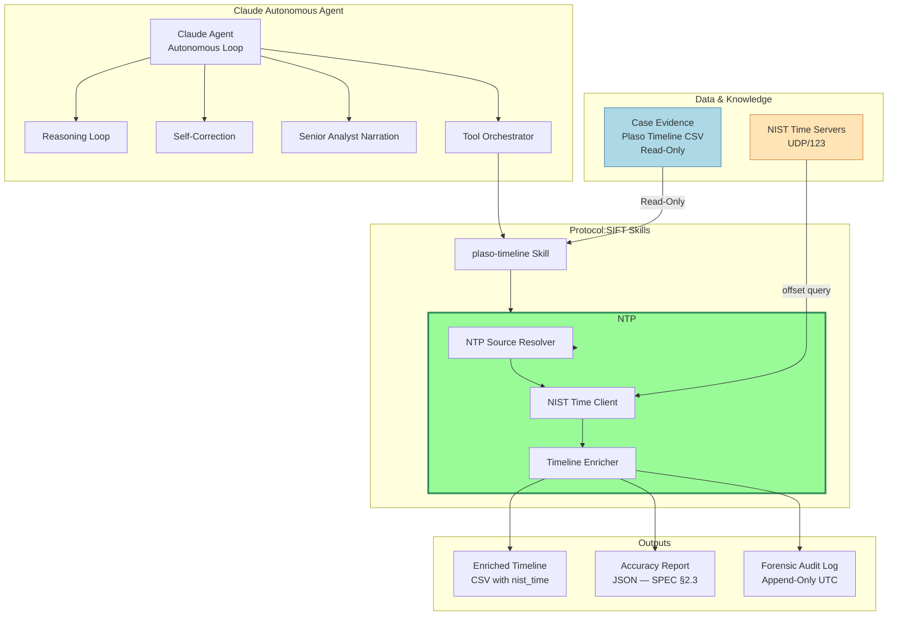

# Architecture
## NTP Enrichment — Plaso Super-Timeline
### SANS FindEvil Hackathon · hackasans-correlator

Narrative architecture and design rationale. For the step-by-step build
sequence and acceptance gates, see [PROMPTS.md](PROMPTS.md); for the behavior
spec, [SPEC.md](SPEC.md); for the analyst-facing features, [FEATURES.md](FEATURES.md);
for deployment, [DEPLOYMENT.md](DEPLOYMENT.md).

## The architecture in one sentence

**Claude Code (the forensic agent) reads `SKILL.md` files as its reasoning
instructions, runs Python scripts as tools via `Bash()`, reads the accuracy
report those scripts emit, and decides autonomously whether to accept the
result or self-correct — re-resolving the NTP source and re-running, up to
3 iterations, then halting with the unresolved rows.**

An earlier draft of this project produced static Python scripts a human runs
manually. That is wrong for Protocol SIFT, which is an *autonomous agent*:
the Claude Code session IS the agent — it reasons, decides, runs tools, reads
their output, self-corrects, and surfaces findings. The Python code is the
agent's hands, not its brain.

## Two things built simultaneously

| Layer | What it is | Who authors it |
|-------|-----------|----------------|
| **Agent instructions** | `SKILL.md` files that tell Claude Code *how to reason* through NTP enrichment — what to check, what to decide, when to loop | Written in the build prompts |
| **Agent tools** | Python scripts (`ntp_resolver.py`, `ntp_nist_client.py`, `ntp_enricher.py`, `ntp_manifest.py`, `sift_logger.py`) the agent invokes via `Bash()` | Claude Code writes these when the prompts are executed |

The `SKILL.md` is not documentation. It is the agent's decision procedure —
Claude Code reads it at the start of every case session. The Python scripts
do the heavy lifting and are deterministic, testable, and audit-safe.

## Agent flow

## How Claude Code operates on the SIFT workstation

On the SIFT workstation, the analyst navigates to a case directory and starts
`claude`. Claude Code then:

1. Auto-loads `~/.claude/CLAUDE.md` — the principal DFIR Orchestrator role,
   forensic constraints, and tool routing table (shipped from
   `protocol-sift/global/CLAUDE.md`)
2. Auto-loads the case `CLAUDE.md` — case-specific evidence paths and IOCs
3. Reads skill files via `@~/.claude/skills/<skill>/SKILL.md` when a domain
   comes up
4. Runs `Bash(...)` tool calls — permission denies and PreToolUse/PostToolUse
   hooks in `settings.json` enforce evidence integrity and execution tracing
5. At session end, fires the `Stop` hook — appends to `forensic_audit.log`
   and runs `capture_session.py` (session transcript copy + per-model token
   usage report)

The agent loop for NTP enrichment fits into steps 3–4: the agent reads the
NTP skill, runs the Python tools, reads the accuracy report they emit, and
decides what to do next — **all inside a single Claude Code session with no
human intervention between steps**.

### The NTP enrichment skill is globally available to all skills on the workstation

`install.sh` deploys the NTP enrichment skill to `~/.claude/skills/ntp-enrichment/SKILL.md`
(via the SKILLS array in the installer). Because `~/.claude/skills/` is the
system-wide skill directory for Claude Code, the NTP skill is available to
**every session on the workstation** — not just sessions started inside the
`protocol-sift` checkout.

This makes cross-skill handoff natural. The `plaso-timeline` skill exports a
Plaso CSV; the agent can immediately invoke the NTP enrichment skill within
the same session to anchor timestamps to NIST UTC, without any additional
setup. The NTP skill's own text says: *"Typically run after the
`plaso-timeline` skill's `psort.py` CSV export — that skill can hand off to
this one for NIST anchoring."*

`protocol-sift` carries two copies of the skill for this reason:

| Path | Loaded when |
|---|---|
| `skills/ntp-enrichment/SKILL.md` | Agent started inside the `protocol-sift` repo checkout (development) |
| `global/skills/ntp-enrichment/SKILL.md` → deployed to `~/.claude/skills/` | Any Claude Code session on the SIFT workstation (production) |

The `global/` variant is the one analysts interact with. It is tuned for the
deployed context: references `analysis-scripts/` relative to `~/.claude/`,
omits development notes, and is authored by P-08 in the build-prompt series.

## The pipeline orchestrator and its exit codes

The deployed ntp-enrichment skill names one tool as **Primary**:
`~/.claude/analysis-scripts/tlcorr_pipeline.sh`, shipped by `install.sh`
alongside the `ntp_*.py` helpers it drives. The agent issues a single Bash
call and the script runs four stages:

| Stage | What happens |
|---|---|
| **1 — Ingest** | Counts events in the input Plaso CSV; no writes to evidence |
| **2 — NTP enrichment** | Delegates to `ntp_enricher.py` (same directory): NTP source resolution → NIST query → 5 new fields → self-correction loop (≤ 3 iterations) |
| **3 — Integrity check** | Re-hashes the input CSV and aborts if the SHA-256 changed (spoliation guard) |
| **4 — Report collection** | Moves the accuracy report JSON to `analysis/` and prints a run summary |

The pipeline always passes `--non-interactive` to the enricher, so the agent
never blocks at an interactive prompt; it supplies `--ntp-source` or
`--skip-ntp` itself based on its Phase 2 artifact findings. Exit codes drive
the agent's next action:

| Exit code | Meaning | Agent response |
|---|---|---|
| `0` | Success | Proceed to the report |
| `2` | NIST servers unreachable | Surface "check outbound UDP/123 or use `--skip-ntp`" |
| `3` | Self-correction exhausted | Halt and display the unresolved rows |
| other | Unexpected error | Log and surface to the analyst |

## Two repos, distinct concerns

- **`ciphentech/hackasans-correlator`** (this repo) is the **authoring** repo:
  design and infrastructure. It hosts this guide, `SPEC.md`, the build-prompt
  series (`docs/prompts/`), and the Terraform in `infra/terraform/` that
  stands up the AWS environment in `us-west-2` (VPC, bastion, SIFT
  workstation, Cognito, CloudWatch, IAM and GitHub Actions OIDC). It also
  documents the design process itself — what decisions were made and why.
  It is never deployed.
- **[`ciphentech/protocol-sift`](https://github.com/ciphentech/protocol-sift)**
  (a **sibling checkout** at `../protocol-sift` — never a subdirectory or
  submodule) is where the agent skill lands. The skill instructions
  (`skills/ntp-enrichment/SKILL.md`), the Python tools
  (`analysis-scripts/ntp_*.py`, `sift_logger.py`), the tests, the
  `global/` home template (CLAUDE.md routing, settings denies + hooks), and
  the `install.sh` that wires everything into the SIFT workstation all live
  there. This is the repo that lands at `~/.claude/` on the SIFT instance —
  the one Claude Code reads at runtime.

The infrastructure that makes the SIFT workstation reachable (double-hop SSM,
Cognito MFA, the read-only `/cases/` mount, the encrypted EBS volumes) is
defined in `hackasans-correlator/infra/` and must be stood up before the
build prompts run. Together the repos make one system: design and infra in
one, agent behaviour in the other.

## AWS infrastructure

The infrastructure is defined using Terraform and includes:

- VPC with public and private subnets
- EC2 bastion host (t3.micro)
- Cognito authentication for secure access
- IAM roles for federated identities
- GitHub Actions OIDC integration for CI/CD

Access flow: Cognito User Pool → Identity Pool → IAM role → SSM Session
Manager → Bastion

See [infra/README.md](../infra/README.md) for deployment instructions.
