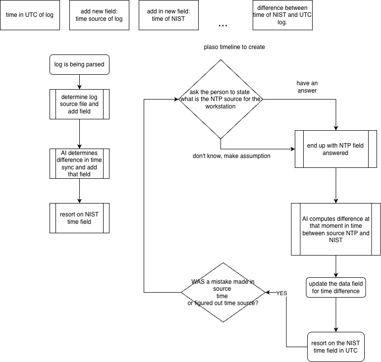

# Build-Prompt Series — Background Reference

This repo (`protocol-sift`) was generated by a 12-step prompt series
(`P-Scaffold` → `P-00` → `P-10`) executed in the sibling authoring repo
[`ciphentech/hackasans-correlator`](https://github.com/ciphentech/hackasans-correlator).

The prompt files and the generator skill live in that repo — not here. This
document is a brief reference so contributors understand where each file in
`protocol-sift` came from and can trace a design decision back to its prompt.

---

## What each prompt built in this repo

| Step | What landed in `protocol-sift` |
|------|-------------------------------|
| P-Scaffold | Repo verified/prepared; upstream SIFT baseline confirmed. No files created. |
| P-00 | `requirements.txt` — Python env and pinned dependencies |
| P-01 | `analysis-scripts/tests/` fixtures (CSVs + ground-truth JSON) and test scaffolds |
| P-02 | `analysis-scripts/ntp_resolver.py` — data model (`ConfidenceRank`, `NTPContext`), EID 35/260 extraction |
| P-03 | `analysis-scripts/ntp_resolver.py` — Phase 2 resolution decision tree |
| P-04 | `analysis-scripts/ntp_nist_client.py`, `ntp_enricher.py` — enrichment core and safe writer |
| P-05 | `analysis-scripts/ntp_enricher.py` — Phase 3 self-correction loop (`validate_and_correct`) |
| P-06 | `skills/ntp-enrichment/SKILL.md` — agent reasoning instructions |
| P-07 | `analysis-scripts/ntp_manifest.py`, `sift_logger.py` — accuracy report and forensic session logger |
| P-08 | `global/CLAUDE.md` routing row, `global/settings.json` hooks, `scripts/hooks/` scripts |
| P-09 | `ntp_enricher.py` CLI section, `test_logger`/`test_spoliation`, `analysis-scripts/tests/smoke_ntp_agent.sh` |
| P-10 | `install.sh`, `analysis-scripts/tests/verify_cloned_repos.sh`, final acceptance suite |

All paths above are relative to the `protocol-sift` repo root.

### Standalone tests (outside the build gate)

P-11 and P-12 are **standalone** tests — not part of the 71-test pytest suite
and never run in the build gate. Each needs an external dependency (Plaso tools
/ a real `.plaso` file, or live network), so they are run by hand on a suitably
provisioned host rather than auto-continued by the generator skill.

| Step | What landed in `protocol-sift` |
|------|-------------------------------|
| P-11 | `analysis-scripts/integration_ntp.sh` — SIFT-workstation integration test for the `psort.py → ntp_enricher` handoff; requires Plaso tools + a real `.plaso` file |
| P-12 | `analysis-scripts/tests/e2e_ntp_live.py` — live e2e test querying a real NTP server (`pool.ntp.org`); requires `ntplib` + network access |

---

## How the prompts map to the enrichment flow

The diagram below shows the full Plaso timeline + NTP enrichment flow that
prompts P-02 through P-07 built. The top row shows the four fields added to
every timeline row. The left column is the parse-and-enrich pipeline. The
right column is the NTP source resolution decision tree, including the
self-correction loop.

### Left column — parse and enrich pipeline (P-02, P-04, P-07)

1. **Log is being parsed** — the Plaso `psort.py` CSV is loaded row by row.
   The parsing logic and data model (`ConfidenceRank`, `NTPContext`) were built
   by **P-02** (`ntp_resolver.py`).
2. **Determine log source file and add field** — `ntp_resolver.py` identifies
   the NTP source from EID 35/260 Windows events in the timeline and writes
   `ntp_source` onto each row. Source-resolution logic was extended in **P-03**.
3. **AI determines difference in time sync and add that field** — `ntp_enricher.py`
   computes the delta between the row's UTC timestamp and NIST time (`nist_delta_s`)
   and adds the `nist_time` field. The enrichment core and safe writer were built
   by **P-04** (`ntp_nist_client.py`, `ntp_enricher.py`).
4. **Resort on NIST time field** — after enrichment, the output CSV is sorted on
   `nist_time` so the timeline reflects NIST-anchored UTC order. The sort and
   output path logic live in `ntp_enricher.py` (P-04).

### Right column — NTP source resolution decision tree (P-02, P-03, P-05)

The right column runs in parallel with the enrichment pipeline and determines
*which* NTP source to anchor to.

- **"Plaso timeline to create"** → the agent receives the psort CSV export and
  enters Phase 1 of the SKILL.md reasoning loop (built by **P-06**).
- **"Ask the person what is the NTP source for the workstation"** — if EID 35/260
  events are absent or ambiguous, the agent prompts the analyst. If the analyst
  knows the source, it is recorded with `ConfidenceRank.ANALYST_PROVIDED`.
- **"Don't know, make assumption"** — if neither event-log evidence nor analyst
  knowledge is available, the enricher falls back to an environment assumption
  (`ConfidenceRank.ASSUMPTION`). Both paths merge at **"end up with NTP field
  answered"**. The confidence ranking logic was built by **P-02** and **P-03**.
- **"AI computes difference at that moment in time between source NTP and NIST"**
  — `ntp_nist_client.py` queries the NIST time service and derives a clock offset
  for the resolved NTP source. This was built by **P-04**.
- **"Update the data field for time difference / resort on the NIST time field in UTC"**
  — `ntp_enricher.py` writes the corrected fields and re-sorts. P-04.

### Bottom — self-correction loop (P-05)

- **"WAS a mistake made in source time or figured out time source? → YES"** — after
  enrichment, `ntp_manifest.py` emits an accuracy report (`rubric_pass`,
  `rubric_failures`, `suggested_corrective_action`). The agent reads it and, if
  the rubric fails, loops back: re-resolves the NTP source and re-runs enrichment.
  This `validate_and_correct` loop (max 3 iterations) was built by **P-05**
  (`ntp_enricher.py`) and the accuracy report by **P-07** (`ntp_manifest.py`).

### Top row — four fields added per timeline row (P-04, P-07)

| Field | What it holds | Built by |
|-------|--------------|----------|
| `time in UTC of log` | Original timestamp from Plaso, normalised to UTC | P-04 |
| `time source of log` (= `ntp_source`) | Resolved NTP source hostname or assumption | P-02 / P-03 |
| `time of NIST` (= `nist_time`) | NIST-anchored timestamp for the row | P-04 |
| `difference between time of NIST and UTC log` (= `nist_delta_s`) | Offset in seconds between NIST and raw UTC | P-04 / P-07 |

---

## Keeping code and prompts in sync

The preferred way to make a significant change to this repo's behaviour is to
update the relevant prompt in `hackasans-correlator` and re-apply the step
here. For smaller changes, edit directly in `protocol-sift` and open a PR —
the build prompts are a historical record, not a live dependency.
