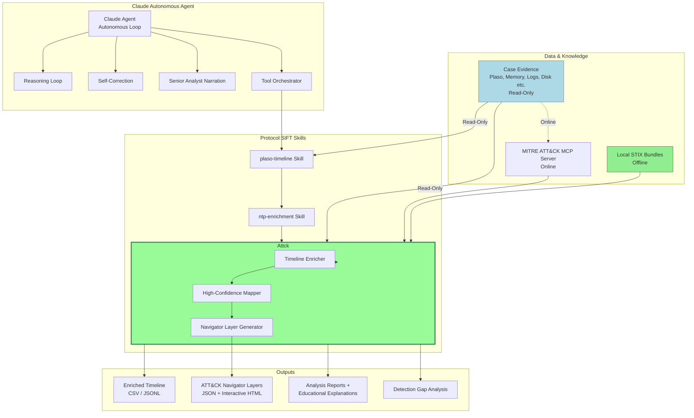

# Architecture

## Overview

This repository contains the Protocol:SIFT skill set and supporting scripts for the Claude Code DFIR agent. Skills are installed to `~/.claude/` on any SIFT workstation and loaded automatically by Claude Code at session start.

## Protocol:SIFT Autonomous DFIR Agent Architecture

