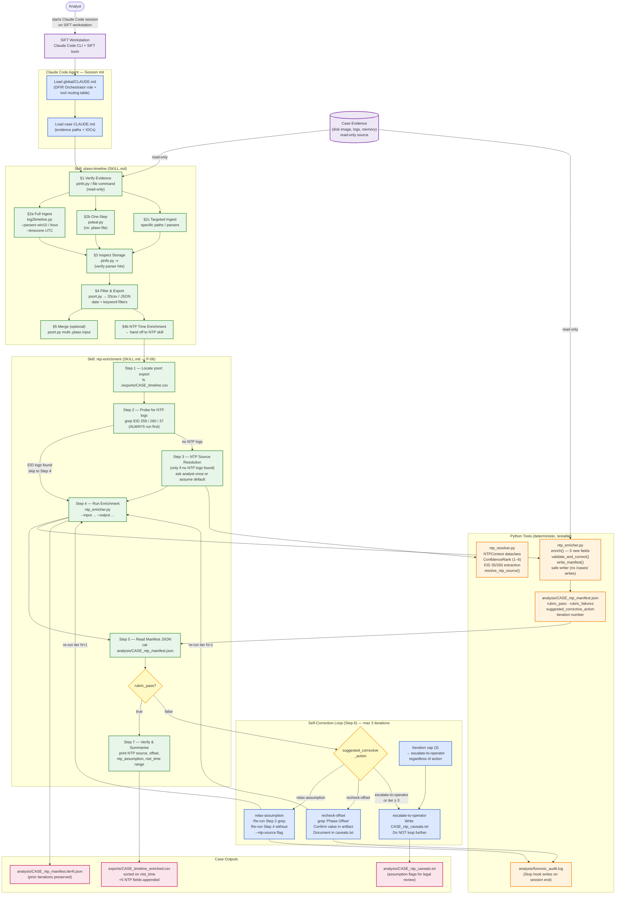

# Plaso Timeline Workflow

## Legend

| Color | Layer |
|-------|-------|
| Blue | Claude Code Agent (reasoning, routing, self-correction) |
| Green | Skill instructions (SKILL.md — agent decision procedures) |
| Orange | Python tools (deterministic, testable — the agent's hands) |
| Pink | Case outputs |
| Purple | SIFT workstation & evidence store |
| Yellow | Decision points |

## Key Design Points

- **Claude Code IS the agent.** The Python scripts are tools it calls via `Bash()` — not the agent itself.
- **SKILL.md files are the decision procedure.** The agent reads them and executes step-by-step with no human intervention between steps.
- **Self-correction is capped at 3 iterations** to prevent infinite loops; iteration 4 always escalates.
- **Evidence integrity is architectural**, not prompt-based: source evidence is never written to; the enricher's safe writer rejects writes to source paths.
- **`ntp_assumption=true` rows must be disclosed** in any legal or regulatory submission (ISC2 requirement).
